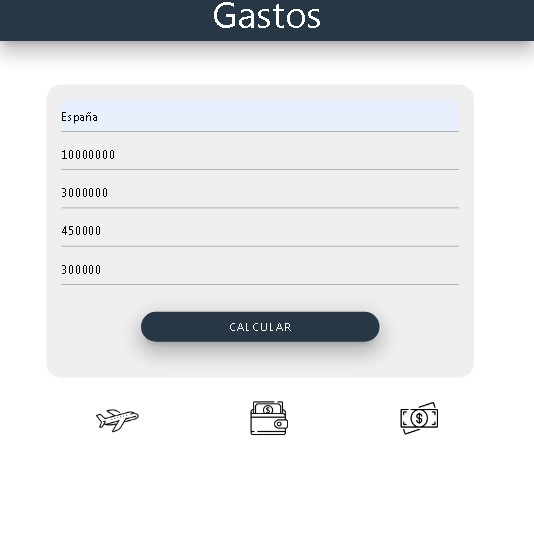

# Calculadora de Gastos de Viaje

   

## Funcionalidades

* Ingresar el destino del viaje.
* Establecer un presupuesto total para el viaje.
* Introducir los costos estimados de:
    * Alojamiento
    * Transporte
    * Comida
* Calcular el total de gastos.
* Mostrar si el presupuesto es suficiente o si se necesita más dinero.

## Tecnologías

* HTML
* CSS
* JavaScript

## Instrucciones de Ejecución

1. Clona el repositorio: `git clone <nanditavelasquez/gasto-viajes`
2. Abre el archivo `index.html` en tu navegador web.

## Contribuciones

Las contribuciones son bienvenidas! Por favor, abre un issue para reportar errores o sugerir mejoras.
